# User Flow e Wireframes
 
## 1. User Flow
 
### Fluxo 01 — Cadastro e acesso de professor
 
**Objetivo do usuário:**
- O professor realizar o seu cadastro, se necessário, para acessar o sistema.
 
**Ator:**
- Corpo Docente
 
**Histórias de Usuário relacionadas:**
- História 08 — Cadastro de professor
- História 10 — Acesso à plataforma
 
**Diagrama:**
- [\[User Flow 1 - Cadastro e acesso do professor\]](https://viewer.diagrams.net/?tags=%7B%7D&lightbox=1&highlight=0000ff&edit=_blank&layers=1&nav=1&title=User%20Flow%201%20%E2%80%94%20Cadastro%20e%20acesso%20do%20professor.drawio&dark=auto#R%3Cmxfile%3E%3Cdiagram%20name%3D%22P%C3%A1gina-1%22%20id%3D%22Np32uDrwuNgszCeUwwpi%22%3E7VvbcuI4EP0aqiYPpJB8wTwGksxMbWY2lWxld%2FZNsYWtibFYWQTI149kC9%2BAxAWWTWbzklgtyZb79Gl3t0TPmMxWnxmaB9%2Boh8MeHHirnnHZg3BoQPFXCtapADojJ5X4jHipDOSCe%2FKClXCgpAvi4bg0kFMacjIvC10aRdjlJRlijC7Lw6Y0LD91jny8Jbh3Ubgt%2FZt4PFBS2zLzji%2BY%2BIF6NDQMO%2B2Zoc1o9SpxgDy6LIiMq54xYZTy9Gq2muBQam%2BjmHTe9Z7ebGUMR7zOBOjED3cv7OFbH%2FaDpyt%2F%2FHM46au7YG9LDfltlSimC%2BaqUcYonP51Ax%2FhH39ad5%2F%2FHcZD63vfUOP4eqM9edt71aSMB9SnEQqvcumY0UXkYbnCgWjlY24onQshEMKfmPO1sgy04FSIAj4LVS9eEf6PnH5uqdaPQs%2FlSt05aawLjVvMyAxzzJRM2RZiPuavvKOVASdMHlNxB7YW8xgOESfPZR0iZXt%2BNi5HR1wogHaD9ZqCd2GT6zzmjD5lxgrL2hI2OJfjZitf8vV8GtKlGyDGz4UmZiRCnAqFjJcB4fh%2BjhK4l2JkpqBnFC7Ug75GvYnRu7h0CVV9mHG8KqxrW09BgSq24sWywKsN7Tf%2Bw1Jt5T765kZwjG53EsFokAjWuyFCJFRXmCSbP4p9%2BbSktZlXkyzDLsli1SFLrnWwx%2BwLGt5iwC2jUxzHgjJi%2Fa64QuKCyoVFN%2BSxMVLACilMq0yKbFLjpACwQVYMu2QFOBVOgFSnLbBiJ6Lwt0F0cCqIOkfiqabeUiL0n7PcqLDcrJA8RUfNqlhFtozD3eewlvsM6OxxEb%2FtOpO442sUi2B%2BrzOlcbwgMpRHHpJBTM%2B47kE7FA8fe%2BRZXPo8mZeKHpl85YpQiEpDD3DAzrYDdir%2B164gAwba%2FG%2BT4bnzEZUkeoDHEvaosMTRH5bcYRSSF8SKXNIUi1hmOUCH2phgNcgE%2BEEFlVB2ms7CFrhwyzCO3ABLMnjIo3FbTAAjbZlqo1QYnUoMl9PiLSqUiJDzotso7jgmjPQzYUIZIz7RTgTTKBPB1Jadbh7cTPGy06LNyaSn5rFfhN3ZjD2qGIVRMYp0YU1kM7tNpUmf2a2pnEzemzqtzmrh9ep7DSaol6nXHDwnZW8QkqSZJp7xHEWlJ9v%2FLWiSpiL3yU%2Bw77s0lMX1C6lbhqJ4s%2FKxjNPzvlB6276H2NMn5j9%2BEjwRChps%2Fp2l%2F2UPtKy0Ubw4O0vTYfX4LBXOc2mh7XS15dR5T4rdQX5t2WVfYTSRVLzi7DR%2FdrMMTO5RuuEi3TTxtKVktt3W9xfYDTpVAMxOverpJGUAdOpYMyAaZAWjXKycRiVFlLYSp5TNkPbYdDTUkKTt0aLduhYvki0oqUS5DzUXxoISterSpmMPW%2FI00GzU03Sa855MqA8Kp1A68TP1kt7DI7i3%2BPIR0LUT0I1GGgK63aWxRv1EdnCrcz9RuzYGtNTG2tuzfh2IFr%2BlbVXLwMBpLVxv9iMK30u4XtvIzW4%2Fh1C3kU9DMv%2BirkPsI3d9EbkBZUnVLS4MetjHimv0kuykhNQnUVtBurb0H9TL%2F1s7UCnDEAcwLKN3WR8YzPPzZQ2punq%2BsnKUwda2aQVquXDxerys312KSwGZpBHWZUQj6VqmJAwrIiQiL2n7rniiPOc7lgokLgovVMeMeN4Ov7QFzPckQDQOK9kY2zDYZRSs6inXanG8ORRqnSA%2BURTuyUwTAGAA20IANnnOuONM9mR2IlSxpbMzlU6DmJq%2F%2FeHxpHXgzy%2FA0fuTxyE9apS99gfUJwu18RGw7P1empWzTibQVtB5hV8nj4K%2BgGUIWgOgVlb6vwPAqVZt9AHwnkN2zX4IgOpZswNgEM38N7jpeaP8p8zG1S8%3D%3C%2Fdiagram%3E%3C%2Fmxfile%3E)
 
### Fluxo 02 — Cadastro e acesso de responsável

**Objetivo do usuário:**
- O responsável legal realizar o seu cadastro, se necessário, para acessar o sistema.
 
 **Ator:**
- Responsável Legal
 
**Histórias de Usuário relacionadas:**
- História 09 — Cadastro de responsável
- História 10 — Acesso à plataforma
 
**Diagrama:**
- [\[User Flow 2 - Cadastro e acesso do responsável\]](https://viewer.diagrams.net/?tags=%7B%7D&lightbox=1&highlight=0000ff&edit=_blank&layers=1&nav=1&title=User%20Flow%202%20%E2%80%94%20Cadastro%20e%20acesso%20do%20respons%C3%A1vel.drawio&dark=auto#R%3Cmxfile%3E%3Cdiagram%20name%3D%22P%C3%A1gina-1%22%20id%3D%22-Rl10elZXPRa_RMJ58PX%22%3E7VvfU6Q4EP5rpmr3QYuEgZl51FFvrfKurLNuvX3aihAhZyCzIePM%2BNdfAmH45SirBLg9X5R0EsL011%2FT3QkTexltf%2BNoFf7OfEwn0PK3E%2FtsAuECOPKvEuwywcyyM0HAiZ%2BJQCG4IU9YCy0tXRMfJ5WBgjEqyKoq9FgcY09UZIhztqkOu2e0uuoKBbghuPEQbUpviS9CLXWdadHxBZMg1EtD23azngjlo%2FVPSULks01JZJ9P7CVnTGRX0XaJqVJerphs3sWB3v2TcRyLNhO%2Be1fhpbuzxfe%2FHi7Z7fLH7dfdkb4L9htqKG6rRQlbcw%2B%2FcC%2Box4ldrj112xvdZFyELGAxoueF9JSzdexj9YSWbBVjrhhbSSGQwn%2BwEDttGWgtmBSFIqK6F2%2BJ%2BFtNP3Z061up52yr75w2dqXGNeYkwgJzLdO2hXiAxQu%2FcboHTlo8ZvIOfCfncUyRII9VHSJte8F%2BXIGOvNAA%2FQRY8DA2hc4TwdnD3lhhVVvSBldqXLQNFF2P7ynbeCHi4lhqIiIxEkwq5HQTEoFvViiFeyNH7hX0iOhaL3QZT5b25OTMI0z3YS7wtvRcTT2FJaq4mhebEq9y2uu7zPIxu5x3liHV2h3yYPqf4UEsVVeapJrfyn3FtLSVz2vJldmQXJkexq%2FApdA6OGD1JQ03CPAnTlYsTlIWgMf0vSfnJgmSF0w9X3xF7jqjBqxRw3Eq1LAdU9RwOqTGbEhqgLEQA7pDMsP9VfC0xoLn4p1w6qnXjEj9FwyfVhnuzGoMz9DRs2pGsX%2BMt9vJrJUHDVl0t05e955p5HEZJzKcP%2BRPr1mSrIkK5pGPVBgzsS8m0KVy8VOfPMrLQKTzMtEdVz%2B5JpSiytA3ON950%2FnOa753VkMGmPK98w65uvgIS7KU54AN9ON9F33EJYiSJ8TLTDIUhThONUB3bVNMyCnWCRVAU%2BX%2FUy4MGomAFyDsigzXHOPYC7Fig498lvRFhblljAqwSyrYYwnhClq8RoUKEQpeDBvEvQ9S2zwTloxzEhDjRJhOa0Ubqx64dqe2aZdMcIdkwmiSU%2FDess2BbMaqW8W0ZhXZkxlLZ0CXdYxhbWU0iW%2FmtgZzmm4rp9lhhnqW%2BU3rMav5UZI2s8wzWaG4srL7Y83SPBV5D0GK%2FZHHqKqvnyjdchQn%2BZOfqlC96KPK3x75iD984sHdJ8kTqSAr%2F%2Fc5%2B696oCoCqkb54vPnLB%2FWy%2B9z4SKZltrOnraaOx%2FIsQdIsPelDu0sFubSinZVjve9ePdJmNqm9Og62zfxjWVl7qy%2FN3CXFQrwUaLQBWI4qF%2FtvkbBmZAPzuKKGip7ifeMR8h4bLqY95Wk5Qv3qMSTdPNJ6VDtQK2kqaBUq6aUOZ%2FN%2BnIzueq6OacAh3Qzown04bBnGaDh4O01tnzEcv3EcsCy%2BgrmYJenOOCgxzjKXqJ1YQwYKYwNu1sNuz%2FI8Zpn6KtQBqxFb3E67LL6AYetfvxEnN7SxMGgxV%2FYro7xDhO%2Fp2T1RV9THCBvdxJ7IeNpsS0pDfp6iBMX6CndQqEsIHFf0bm53UTYKu3v7SilCkHmgGMVt6uygDS8%2BtGyjjReP2BZO8kAbHMJ0byNyuXvE1U9P6fADJhlFmWdxSxWDuaeUFoTIRl9KQ54ckV10vdUaZB4iJ7ojoj4%2FjPeqQHQHykS9tsqNnYTB7cKg1M75%2BrMjaHQKrcfKQo3JDIEALDsvhDIF%2FoFUtnR7EOUvqcY4P1td1mcAMMeqeyhBpq23vj5BRz0TLkNu6Su9QH0aIFudRxjpG9Jw7HK1KknrdDYq7JV7j9SGMwFKzPYHwLOBwLPIDBvFG7MIdCqODBSBAy7IgAaR83egINsFh%2FhZqeNik%2BZ7fN%2FAQ%3D%3D%3C%2Fdiagram%3E%3C%2Fmxfile%3E)

### Fluxo 03 — Busca e acesso aos materiais

**Objetivo do usuário:**
- Permitir que professores e responsáveis encontrem e acessem materiais pedagógicos adaptados de forma prática e organizada.
 
 **Ator:**
- Corpo Docente e Responsável Legal
 
**Histórias de Usuário relacionadas:**
- História 01 — Buscar materiais pedagógicos adaptados para estudantes com Síndrome de Down e TEA.
- História 03 — Acesso aos materiais pelos responsáveis.
 
**Diagrama:**
 - [\[User Flow 3 - Busca e acesso aos materiais\]](https://viewer.diagrams.net/?tags=%7B%7D&lightbox=1&highlight=0000ff&edit=_blank&layers=1&nav=1&title=User%20Flow%2003%20%E2%80%94%20Busca%20e%20acesso%20aos%20materiais&dark=auto#Uhttps%3A%2F%2Fdrive.google.com%2Fuc%3Fid%3D1YSe4OED6Se6HJAUASo4ZLhriE4aW9802%26export%3Ddownload)

### Fluxo 04 — Uso dos materiais e acompanhamento

**Objetivo do usuário:**

- O responsável informar as necessidades, preferências e particularidades da criança e acompanhar seu nível de aprendizagem e desenvolvimento.

**Ator:**

- Responsável legal

**Histórias de Usuário relacionadas:**

- História 04 — Informar necessidades e particularidades da criança
- História 05 — Acompanhamento do nível de aprendizagem

**Diagrama:**

- [\[User Flow 4 - Uso dos materiais e acomapnhamento\]](https://viewer.diagrams.net/?tags=%7B%7D&lightbox=1&highlight=0000ff&edit=_blank&layers=1&nav=1&title=User%20Flow%2004%20%E2%80%94%20Uso%20dos%20materiais%20e%20acompanhamento.drawio&dark=auto#R%3Cmxfile%3E%3Cdiagram%20name%3D%22P%C3%A1gina-1%22%20id%3D%22geMToWpBZgCpc1PWf9BQ%22%3E7VrbcpswEP0aP6ZjgwH7MbFzcZuknXoml74pIIMygKiQb%2Fn6rkA21%2FiCwZnp8JAELWKRzu45Wil01JG3umUocB6ohd2O0rVWHXXcUZTeUNPhj7CspaWnDGOLzYglbYlhSj6wNHaldU4sHGY6ckpdToKs0aS%2Bj02esSHG6DLbbUbd7FsDZOOCYWoit2h9JhZ3YutAMRL7HSa2s3lzT5fz89Cms5xJ6CCLLlMm9bqjjhilPL7yViPsCvQ2uMTP3Xxydzswhn1%2ByAN%2FjaeHV0YfFXT3%2BzVED6P1u35R4kWaQr7eYAB%2BAG5oXC0dwvE0QKa4s4SQg83hngutHlzCFAM88UMImbSgMIijMiMrDAO5ip0vkDuXziePk9HkpzRjxvEqNQw5k1tMPczZGro4KbAHEtllKjDSJJ2oumyvs1mFZFbYW8cJcHAhsTsCRyX2i61CNu0CNsJLgOPi1aVIVgAI%2B5a8HJsuCkNiZjFmdO5bAspxtwzO%2FahpEgOGXcTJIjveFJTaDqzkG35RApNL0B4Ov2k5vHNOQjpnJpbPpZN1v6v8eDhiNuYFV1H4tlOvHlH1iIhGk9rPsjSlwO1UNinjDrWpj9zrxJqLc9LnntJApsI75nwtJRPNOc0mCgFBZKL3M1oHAqVQ3sArwl%2BEX0A4br2m7oxX8pVRY53JsxjyfRMtpl9pqp3CwRfjg9z%2FnX03%2B%2Fhxzp97P4w%2FF4dpWRbWPXpWYNelicMQMTBS%2BJn49%2BStknL1i8rVU3LS1c9Jl16DdpXipjSP2xS72CSQvgI6JJZrRpDfGamdSwNVQlA9HkGlMQS1Vv3LJHtb%2Bhyr%2Fv3unsjVp%2F2l8dTbeJbFU61vNd9y80wRNQ4J4GkaN%2FFnlHmRwsFOBNYJYiGxdVFG4sUMzzCLBO%2FSNwnMWtFdGMjVGxNzVXSbRz67Iu3igXJizl3ENl4qaKR%2BvEaqu%2FLkJI0ctJwqI0K%2FLo3sn1kjh80zCmjRUdSeeHSK3EVELRKzLC4dxO8rTbBj2zFzWU9ltmdP2Teaosxmt9pyJssZrSpnSlydmTW9M2xSUhRI9ivIpF6AfAd58F6aYYlYcyxRlCNYpXyLfCAbezVSqsIypDXHKaXlVBkR9HxBVp1T%2BuDMnDpm%2B5U6qtlJ0P%2FqrGbHTL%2FssGbQvBA%2BkXCOXNCzqCaPSobxIvoHBeJwY0cJbuGCHFYQPu144dOHjZ3ytMVEqVoZeSfVhc%2FIB69h4TssgrUVExk6BYzaDIqLslIijBhGFputa5PF%2BT5CDfJnFvURqq0kSlkwrGtHW3DUNJ3Ur6MT8AR7AfadT0rz7Hl592ur82FznGpP0ks5NahvkRqce5FqD9PLZTK%2FxT3hX%2BPd%2FHcNTcf0oOK90c9GbiYPleSuyjcj%2BXXoALmDZvJlTwx78oGUev0P%3C%2Fdiagram%3E%3C%2Fmxfile%3E)

### Fluxo 05 — Planejamento, atividades e comunicação

**Objetivo do usuário:**

- Permitir que professores criem e gerenciem planejamentos educacionais individualizados, elaborem atividades adaptadas às necessidades dos estudantes e mantenham a comunicação com os responsáveis para acompanhar o desenvolvimento da criança.

**Ator:**

- Corpo Docente e Responsável Legal

**Histórias de Usuário relacionadas:**

- História 02 — Planejamento de ensino individualizado para estudantes com Síndrome de Down e Autismo.
- História 06 — Elaboração de atividades.
- História 07 — Canal de comunicação entre responsável e professor.

**Diagrama:**

- [[User Flow 05 - Planejamento, atividades e comunicação]](https://app.diagrams.net/#G1seaAIuG98MGUHxJbwEGOqDzUt_ag2_6Z#%7B%22pageId%22%3A%22FLqbRzWqSGMqGI3IDefw%22%7D)

# 2. Wireframes

## Tela 01 — Tela inicial

**Objetivo da tela:**

Permitir que o usuário escolha seu perfil para acessar a plataforma.

**User Flows relacionados:**

- Fluxo 01 — Cadastro e acesso de professor
- Fluxo 02 — Cadastro e acesso de responsável
- Fluxo 03 — Busca e acesso aos materiais

**Histórias de Usuário relacionada:**

- HU01 — Buscar materiais pedagógicos adaptados para estudantes com Síndrome de Down e TEA
- HU03 — Acesso aos materiais pelos responsáveis
- HU08 — Cadastro de professor
- HU09 — Cadastro de responsável 
- HU10 — Acesso à plataforma

**Wireframe:**

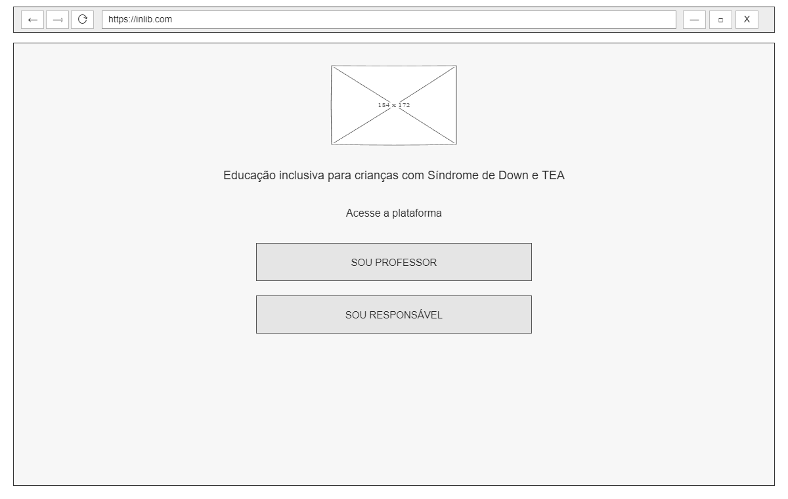

**Principais elementos da tela:**

- Logo do inLib
- Mensagem sobre educação inclusiva
- Botão "Sou professor"
- Botão "Sou responsável"
- Barra de navegação do navegador

---

## Tela 02 — Login de professor

**Objetivo da tela:**

Permitir que o professor acesse a plataforma com suas credenciais.

**User Flow relacionado:**

- Fluxo 01 — Cadastro e acesso de professor

**História de Usuário relacionada:**

- HU10 — Acesso à plataforma

**Wireframe:**

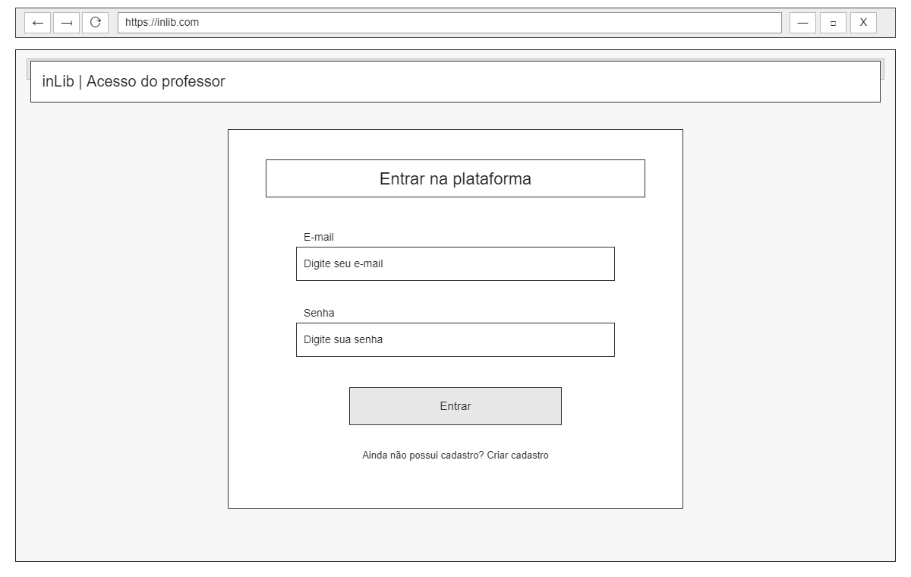

**Principais elementos da tela:**

- Logo
- Título "Acesso do professor"
- Campo de e-mail
- Campo de senha
- Botão "Entrar"
- Link "Criar cadastro"
- Botão "Voltar"

---

## Tela 03 — Cadastro de professor

**Objetivo da tela:**

Permitir que o professor crie uma conta na plataforma.

**User Flow relacionado:**

- Fluxo 01 — Cadastro e acesso de professor

**História de Usuário relacionada:**

- HU08 — Cadastro de professor

**Wireframe:**

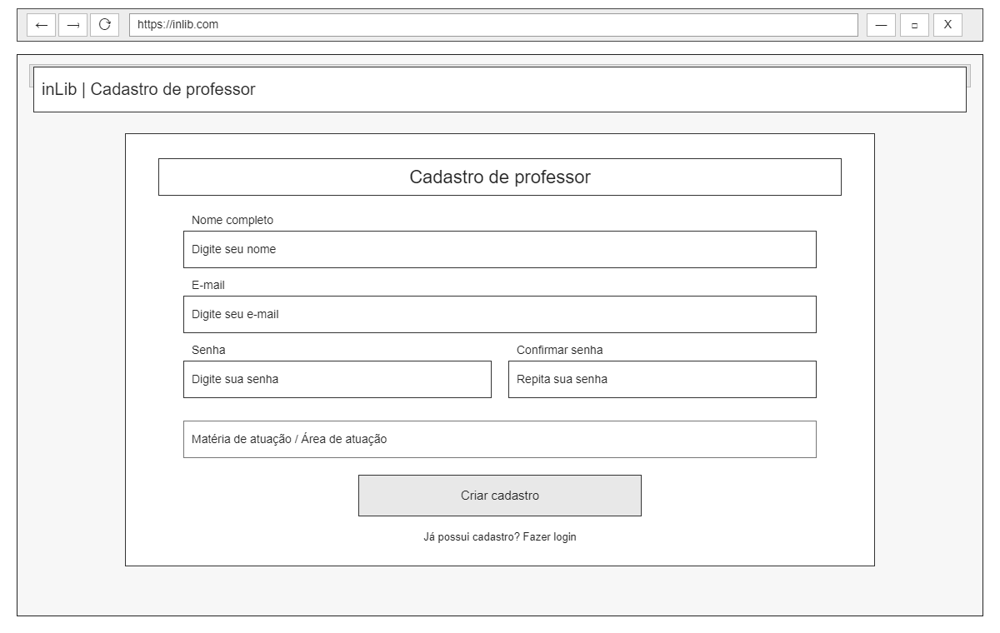

**Principais elementos da tela:**

- Logo
- Nome completo
- E-mail
- Senha
- Confirmação de senha
- Matéria/área de atuação
- Botão "Criar cadastro"
- Link "Fazer login"
- Botão "Voltar"

---

## Tela 04 — Área do professor

**Objetivo da tela:**

Oferecer ao professor acesso às principais funcionalidades da plataforma.

**User Flows relacionados:**

- Fluxo 01 — Cadastro e acesso de professor
- Fluxo 05 — Planejamento, atividades e comunicação

**Histórias de Usuário relacionadas:**

- HU02 — Planejamento de ensino individualizado
- HU06 — Elaboração de atividades
- HU07 — Canal de comunicação entre responsável e professor

**Wireframe:**

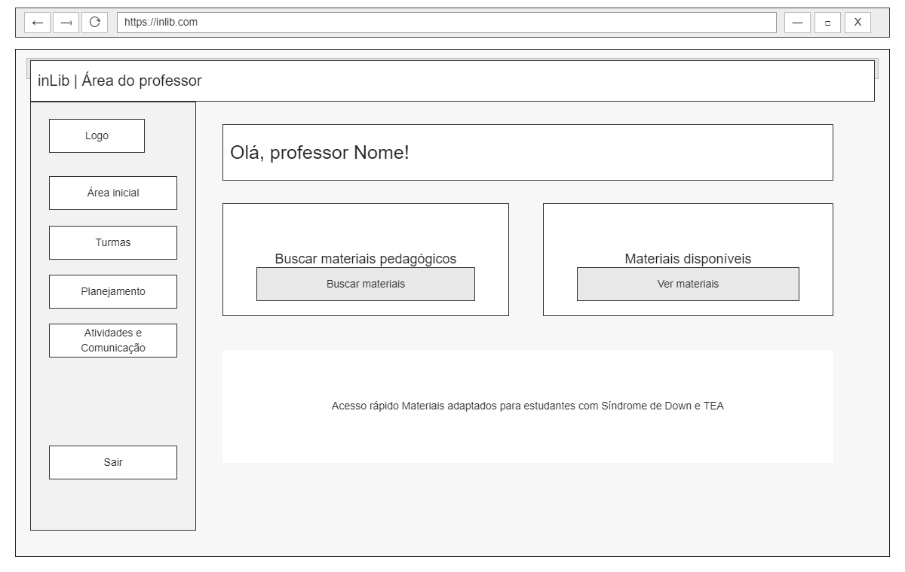

**Principais elementos da tela:**

- Logo
- Menu lateral
- Turmas
- Materiais
- Planejamento
- Atividades
- Comunicação
- Perfil
- Mensagem de boas-vindas
- Busca de materiais
- Botão "Buscar materiais"

---

## Tela 05 — Login de responsável

**Objetivo da tela:**

Permitir que o responsável acesse a plataforma com suas credenciais.

**User Flow relacionado:**

- Fluxo 02 — Cadastro e acesso de responsável

**História de Usuário relacionada:**

- HU10 — Acesso à plataforma

**Wireframe:**

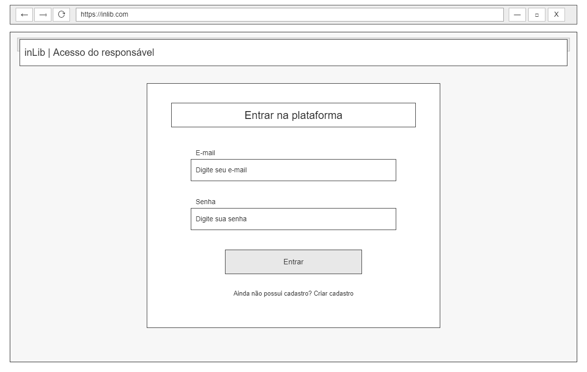

**Principais elementos da tela:**

- Logo
- Título "Acesso do responsável"
- Campo de e-mail
- Campo de senha
- Botão "Entrar"
- Link "Criar cadastro"
- Botão "Voltar"

---

## Tela 06 — Cadastro de responsável

**Objetivo da tela:**

Permitir que o responsável crie uma conta na plataforma.

**User Flow relacionado:**

- Fluxo 02 — Cadastro e acesso de responsável

**História de Usuário relacionada:**

- HU09 — Cadastro de responsável

**Wireframe:**

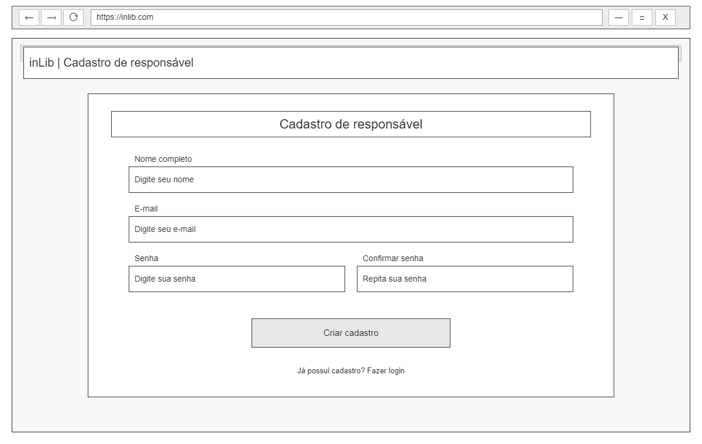

**Principais elementos da tela:**

- Logo
- Nome completo
- E-mail
- Senha
- Confirmação de senha
- Botão "Criar cadastro"
- Link "Fazer login"
- Botão "Voltar"

---

## Tela 07 — Área do responsável

**Objetivo da tela:**

Oferecer ao responsável acesso aos materiais e às informações relacionadas à criança.

**User Flows relacionados:**

- Fluxo 02 — Cadastro e acesso de responsável
- Fluxo 04 — Informar necessidades e acompanhamento

**Histórias de Usuário relacionadas:**

- HU03 — Acesso aos materiais pelos responsáveis
- HU04 — Informar necessidades e particularidades da criança
- HU05 — Acompanhamento do nível de aprendizagem

**Wireframe:**

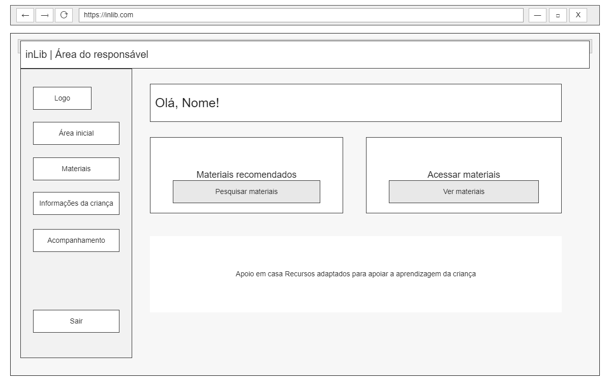

**Principais elementos da tela:**

- Logo
- Menu lateral
- Materiais
- Informações da criança
- Acompanhamento
- Comunicação
- Perfil
- Mensagem de boas-vindas
- Área de acesso aos materiais
- Identificação do usuário

---

## Tela 08 — Busca de materiais

**Objetivo da tela:**

Permitir a pesquisa e filtragem de materiais pedagógicos adaptados.

**User Flow relacionado:**

- Fluxo 03 — Busca e acesso aos materiais

**Histórias de Usuário relacionadas:**

- HU01 — Buscar materiais pedagógicos adaptados
- HU03 — Acesso aos materiais pelos responsáveis

**Wireframe:**

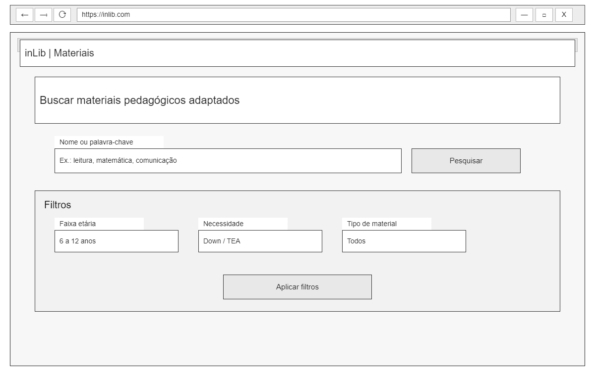

**Principais elementos da tela:**

- Logo
- Campo de pesquisa
- Botão "Pesquisar"
- Filtros
- Faixa etária
- Necessidade
- Tipo de material
- Botão "Aplicar filtros"

---

## Tela 09 — Resultados da busca

**Objetivo da tela:**

Apresentar os materiais encontrados de acordo com a pesquisa realizada.

**User Flow relacionado:**

- Fluxo 03 — Busca e acesso aos materiais

**Histórias de Usuário relacionadas:**

- HU01 — Buscar materiais pedagógicos adaptados
- HU03 — Acesso aos materiais pelos responsáveis

**Wireframe:**

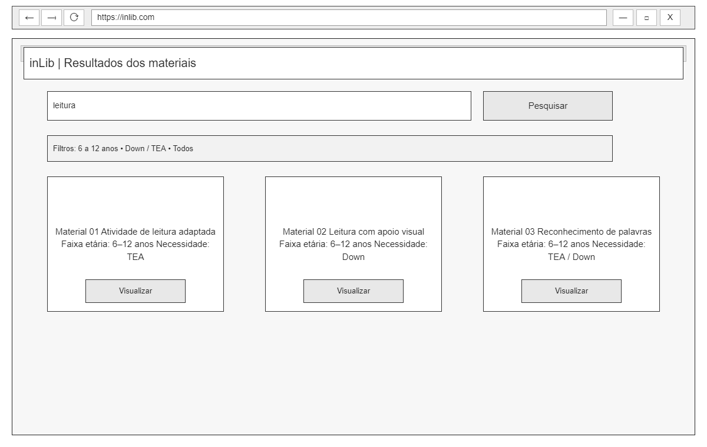

**Principais elementos da tela:**

- Logo
- Campo de pesquisa
- Filtros aplicados
- Lista de materiais
- Informações dos materiais
- Botões "Visualizar"

---

## Tela 10 — Visualização do material

**Objetivo da tela:**

Permitir que o usuário consulte os detalhes de um material antes de acessá-lo.

**User Flow relacionado:**

- Fluxo 03 — Busca e acesso aos materiais

**Histórias de Usuário relacionadas:**

- HU01 — Buscar materiais pedagógicos adaptados
- HU03 — Acesso aos materiais pelos responsáveis

**Wireframe:**

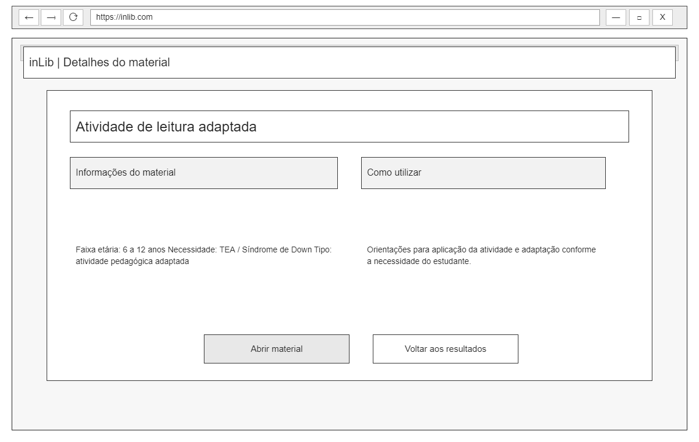

**Principais elementos da tela:**

- Logo
- Título "Detalhes do material"
- Nome do material
- Informações do material
- Faixa etária
- Necessidades atendidas
- Orientações de utilização
- Botão "Abrir material"
- Botão "Voltar aos resultados"

---

## Tela 11 — Seleção da criança

**Objetivo da tela:**

Permitir que o professor selecione o estudante para iniciar seu planejamento.

**User Flow relacionado:**

- Fluxo 05 — Planejamento, atividades e comunicação

**História de Usuário relacionada:**

- HU02 — Planejamento de ensino individualizado

**Wireframe:**

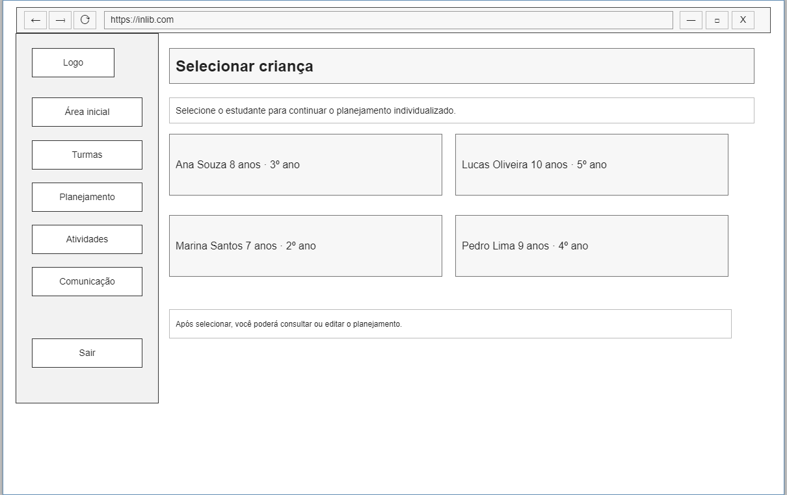

**Principais elementos da tela:**

- Logo
- Menu lateral do professor
- Título "Selecionar criança"
- Lista de estudantes
- Nome e idade dos estudantes
- Ano/turma
- Seleção do estudante

---

## Tela 12 — Planejamento individualizado

**Objetivo da tela:**

Permitir que o professor registre o planejamento individualizado do estudante.

**User Flow relacionado:**

- Fluxo 05 — Planejamento, atividades e comunicação

**História de Usuário relacionada:**

- HU02 — Planejamento de ensino individualizado

**Wireframe:**

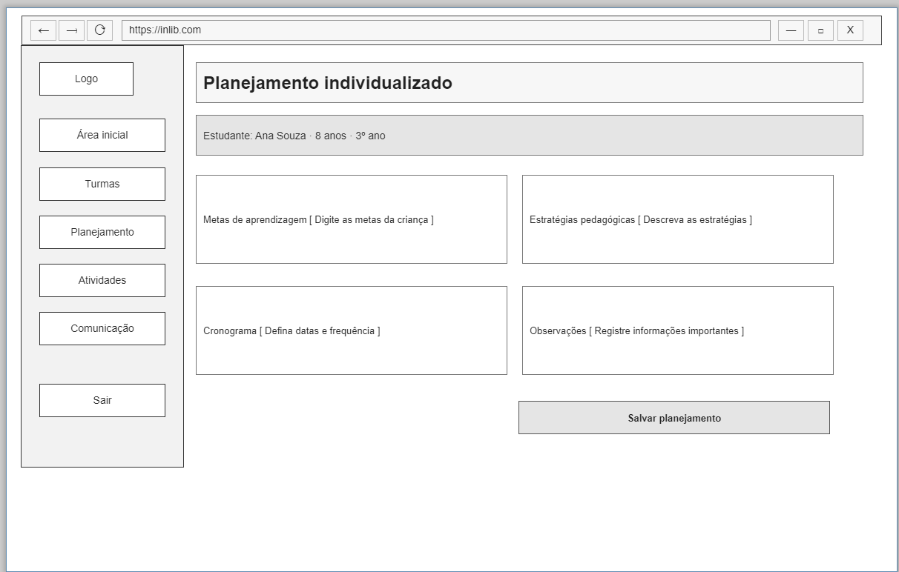

**Principais elementos da tela:**

- Logo
- Menu lateral do professor
- Identificação do estudante
- Metas de aprendizagem
- Estratégias pedagógicas
- Cronograma
- Observações
- Botão "Salvar planejamento"

---

## Tela 13 — Atividades

**Objetivo da tela:**

Permitir que o professor selecione uma turma e um aluno, utilize materiais de apoio da plataforma e elabore uma atividade adaptada para o estudante, podendo pré-visualizá-la e baixá-la.

**User Flow relacionado:**

- Fluxo 05 — Planejamento, atividades e comunicação

**História de Usuário relacionada:**

- HU06 — Elaboração de atividades

**Wireframe:**

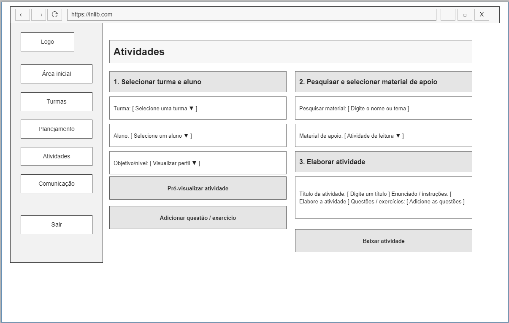

**Principais elementos da tela:**

- Logo
- Menu lateral do professor
- Seleção de turma
- Seleção do aluno
- Objetivo/nível
- Pesquisa e seleção de material de apoio
- Título da atividade
- Enunciado/instruções
- Questões/exercícios
- Botão "Pré-visualizar atividade"
- Botão "Adicionar questão / exercício"
- Botão "Baixar atividade"

---

## Tela 14 — Comunicação

**Objetivo da tela:**

Permitir que o professor selecione um responsável, acompanhe a conversa e envie mensagens, podendo também anexar materiais ou orientações.

**User Flow relacionado:**

- Fluxo 05 — Planejamento, atividades e comunicação

**História de Usuário relacionada:**

- HU07 — Canal de comunicação entre responsável e professor

**Wireframe:**

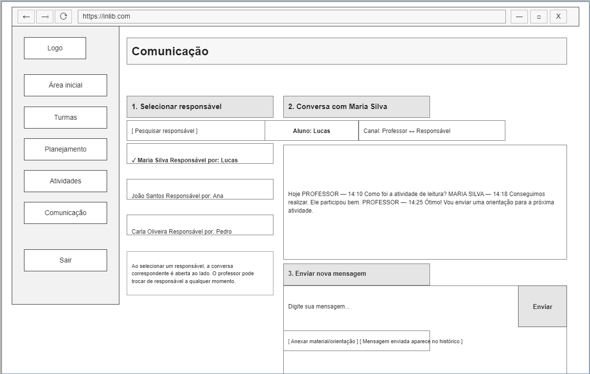

**Principais elementos da tela:**

- Logo
- Menu lateral do professor
- Seleção do responsável
- Busca de responsável
- Lista de responsáveis
- Identificação da criança
- Área da conversa
- Histórico de mensagens
- Campo para nova mensagem
- Botão "Enviar"
- Opção "Anexar material/orientação"

---

## Tela 15 — Informações da criança

**Objetivo da tela:**

Permitir que o responsável registre informações importantes sobre a criança.

**User Flow relacionado:**

- Fluxo 04 — Informar necessidades e acompanhamento

**História de Usuário relacionada:**

- HU04 — Informar necessidades e particularidades da criança

**Wireframe:**

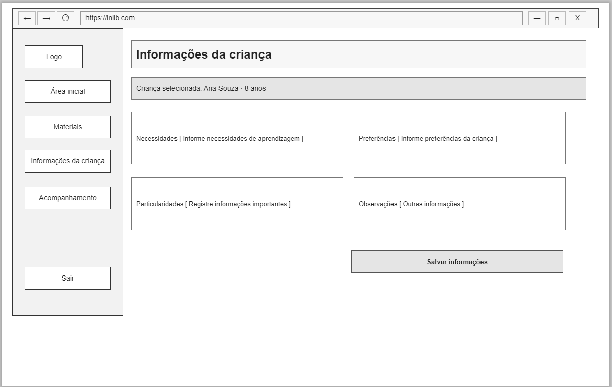

**Principais elementos da tela:**

- Logo
- Menu lateral do responsável
- Identificação da criança
- Necessidades de aprendizagem
- Preferências
- Particularidades
- Observações
- Botão "Salvar informações"

---

## Tela 16 — Acompanhamento da aprendizagem

**Objetivo da tela:**

Permitir que o responsável visualize o nível e a evolução da aprendizagem da criança.

**User Flow relacionado:**

- Fluxo 04 — Informar necessidades e acompanhamento

**História de Usuário relacionada:**

- HU05 — Acompanhamento do nível de aprendizagem

**Wireframe:**

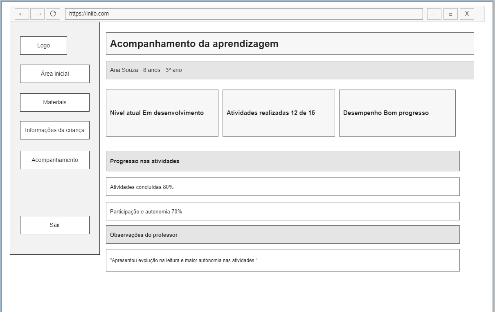

**Principais elementos da tela:**

- Logo
- Menu lateral do responsável
- Identificação da criança
- Nível atual de aprendizagem
- Atividades realizadas
- Desempenho
- Progresso nas atividades
- Observações do professor
